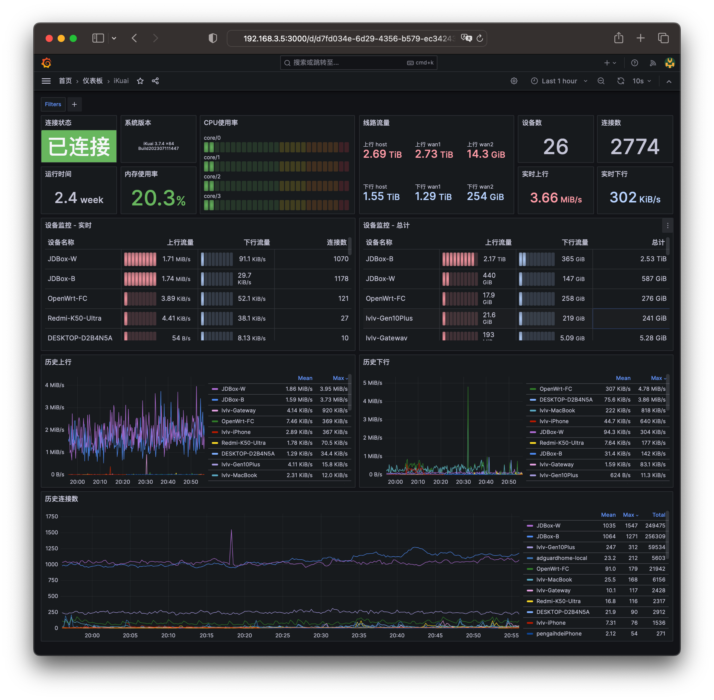

<div align="center">
    <h1>iKuai All in One</h1>
    <p align="center">
        <a href="https://github.com/nervebing/ikuai-aio/blob/master/LICENSE">
            
        </a>
        <a href="https://www.codefactor.io/repository/github/nervebing/ikuai-aio">
            
        </a>
        <a href="https://pkg.go.dev/github.com/nervebing/ikuai-aio">
            
        </a>
        <br>
        <a href="https://goreportcard.com/report/github.com/nervebing/ikuai-aio">
            
        </a>
        <a href="https://actions-badge.atrox.dev/NERVEbing/ikuai-aio/goto">
            
        </a>
    </p>
    <a href="grafana/dashboard.jpg">
        
    </a>
</div>

---

### 主要功能

- 开箱即用的`Prometheus Exporter`和配套的`Grafana Dashboard`
- 自动更新`自定义运营商IP集`和`域名分流列表`
- 直接作为`Go Module`引用

---

### 使用方法

1. 登录iKuai -> 系统设置 -> 登陆管理 -> 账号设置 -> 添加
2. 根据情况填入用户名密码
3. 确保`默认权限`为`新功能可读写`
4. 确保`权限等级设置`中表头的`访问`为勾选状态
5. 如需运行流控相关定时任务则勾选`流控分流`一行的`修改`权限
6. 保存退出

#### 环境变量

查看 [docker-compose.yml](deploy/docker-compose.yml)

#### 启动服务

```shell
mkdir ikuai-aio && cd ikuai-aio
wget https://raw.githubusercontent.com/NERVEbing/ikuai-aio/master/deploy/docker-compose.yml
# 确保根据实际情况修改 docker-compose.yml 后
docker compose up -d
```

#### 导入 Grafana 面板

查看 [Grafana Dashboard](https://grafana.com/grafana/dashboards/19247-ikuai/) 或直接导入面板ID: `19247`

#### Prometheus Exporter Collectors

| Name                         | Example                                                                                                                                                                              |
|------------------------------|--------------------------------------------------------------------------------------------------------------------------------------------------------------------------------------|
| version                      | ikuai_version{arch="x86",ver_string="3.7.4 x64 Build202307111447",version="3.7.4"} 1                                                                                                 |
| up                           | ikuai_up{id="host"} 1                                                                                                                                                                |
| uptime                       | ikuai_uptime{id="host"} 1.481335e+06                                                                                                                                                 |
| cpu_usage_ratio              | ikuai_cpu_usage_ratio{id="core/1"} 0.06                                                                                                                                              |
| cpu_temperature              | ikuai_cpu_temperature 42.6                                                                                                                                                           |
| memory_size_kilo_bytes       | ikuai_memory_size_kilo_bytes 3.898132e+06                                                                                                                                            |
| memory_usage_kilo_bytes      | ikuai_memory_usage_kilo_bytes 792580                                                                                                                                                 |
| memory_cached_kilo_bytes     | ikuai_memory_cached_kilo_bytes 87504                                                                                                                                                 |
| memory_buffers_kilo_bytes    | ikuai_memory_buffers_kilo_bytes 136664                                                                                                                                               |
| interface_info               | ikuai_interface_info{comment="",display="wan1",id="interface/wan1",interface="wan1",internet="PPPOE",ip_addr="xxx.xx.xxx.xx",parent_interface="wan1"} 1                              |
| device_count                 | ikuai_device_count 26                                                                                                                                                                |
| device_info                  | ikuai_device_info{comment="home-light-mi",display="home-light-mi",hostname="yeelink-light-lamp4_mibt1A2D",id="device/192.168.3.57",ip_addr="192.168.3.57",mac="xx:xx:xx:xx:xx:xx"} 1 |
| network_upload_total_bytes   | ikuai_network_upload_total_bytes{display="home-light-mi",id="device/192.168.3.57"} 7.718279e+06                                                                                      |
| network_download_total_bytes | ikuai_network_download_total_bytes{display="home-light-mi",id="device/192.168.3.57"} 7.008623e+06                                                                                    |
| network_upload_speed_bytes   | ikuai_network_upload_speed_bytes{display="home-light-mi",id="device/192.168.3.57"} 0                                                                                                 |
| network_download_speed_bytes | ikuai_network_download_speed_bytes{display="home-light-mi",id="device/192.168.3.57"} 0                                                                                               |
| network_connect_count        | ikuai_network_connect_count{display="home-light-mi",id="device/192.168.3.57"} 1                                                                                                      |

---

### 致谢

[ztc1997/ikuai-bypass](https://github.com/ztc1997/ikuai-bypass)

[jakeslee/ikuai-exporter](https://github.com/jakeslee/ikuai-exporter)

### License

[License MIT](LICENSE)
